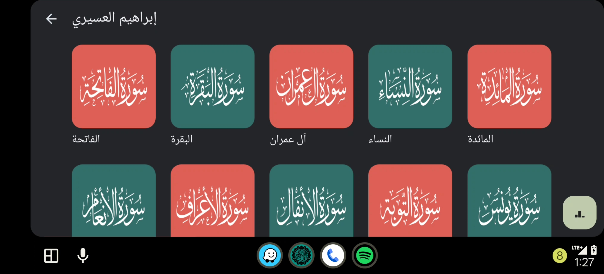

<!--suppress CheckImageSize, HtmlDeprecatedAttribute -->

    
    <h1> AlQuran</h1>
    
Listen to AlQuran anywhere

[//]: # ([![CodeFactor]&#40;https://www.codefactor.io/repository/github/abdalmoniem/AlQuran/badge&#41;]&#40;https://www.codefactor.io/repository/github/abdalmoniem/AlQuran&#41;)
[//]: # ([![Codacy Badge]&#40;https://app.codacy.com/project/badge/Grade/0beba9b2841c40aa982513161d5febe5&#41;]&#40;https://app.codacy.com/gh/abdalmoniem/AlQuran&#41;)
[//]: # ([![Crowdin]&#40;https://badges.crowdin.net/AlQuran/localized.svg&#41;]&#40;https://crowdin.com/project/AlQuran&#41;)

[//]: # ([![IzzyOnDroid]&#40;https://img.shields.io/endpoint?url=https://apt.izzysoft.de/fdroid/api/v1/shield/com.hifnawy.AlQuran&#41;]&#40;https://apt.izzysoft.de/fdroid/index/apk/com.hifnawy.AlQuran&#41;)

# ❓ About

AlQuran is an app that allows you to listen to chapters of the Quran, voiced by different reciters. It
also supports Android Auto.

# 💪 Features

* Listen to chapters of the Quran, voiced by different reciters.
* Support for Android Auto.
* Offline playback.
* Pause and resume playback.
* Seek to a specific position in the chapter.
* Choose your preferred reciter.

    
    
     
    
    
     
    
    
     
    
     
    
     
    
     
    

# 🔽 Download

You can download the most recent version of AlQuran
from [GitHub Releases](https://github.com/abdalmoniem/AlQuran/releases/latest).

[//]: # ([]&#40;https://apt.izzysoft.de/fdroid/index/apk/com.hifnawy.AlQuran&#41;)

[//]: # ([]&#40;https://f-droid.org/packages/com.hifnawy.AlQuran/&#41;)

[//]: # ()

[//]: # ([]&#40;https://play.google.com/store/apps/details?id=com.hifnawy.AlQuran&#41;)

[//]: # ([]&#40;https://github.com/abdalmoniem/AlQuran/releases/latest&#41;)

[//]: # ()

[//]: # (> N.B. App on Play Store is still in testing phase; if you want to join the beta program, please send me)

[//]: # (> an email with your email to be added to the beta testers)

[//]: # (## 🈵 Translations)

[//]: # ()

[//]: # (App strings and the app store description can be translated via)

[//]: # (Crowdin: https://crowdin.com/project/AlQuran)

[//]: # ()

[//]: # (Translations have to be approved before being merged into the app. To become a translator with approval)

[//]: # (rights or to request a new language, please [poke me on Crowdin]&#40;https://crowdin.com/profile/abdalmoniem&#41;)

[//]: # (or open an issue here on GitHub.)
